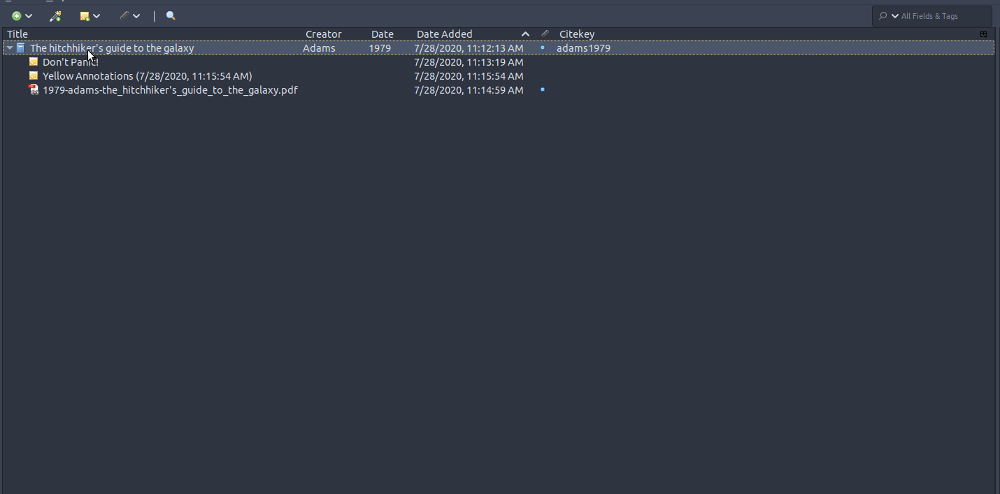

# Mdnotes

A Zotero plugin to export item metadata and notes as markdown files.

## Features

Right now the menu is not context-aware, so read below to see what has to be selected for the menu to correctly create the files. Note that the output of the following options depends on your [configuration](docs/getting-started/configuration.md), the options below apply for the default settings:

| What you want to do                                                       | What to select | Menu |
| ------------------------------------------------------------ | -------------- | --|
| [Export Zotero item metadata file](./docs/getting-started/README.md#export-a-zotero-item-or-notes-to-markdown) | Zotero Item  | `Export to markdown` |
| [Export Zotero notes to markdown](./docs/getting-started/README.md#export-a-zotero-item-or-notes-to-markdown) | Zotero Note    | `Export to markdown` |
| [Create a file for your own notes](./docs/getting-started/README.md#create-a-file-for-your-own-notes) | Zotero Item    | `Create mdnotes file` |
| [Batch export all of the above](http://argenos.github.io/zotero-mdnotes/#batch-export-all-metadata-and-notes) | Zotero Item    | `Batch export to markdown` |

With the exception of `Create mdnotes file` (for your own notes), you will be asked to choose a path. The file name(s) are automatically chosen based on the naming convention described in the section for each menu.

To access the menu right-click on an item or note:  

## Requirements

Tested with Zotero v5.0.89 in Ubuntu 18.04.

It is highly recommended that you have the following plugins installed:

* [Zotfile](http://zotfile.com/)
* [BetterBibtex](https://retorque.re/zotero-better-bibtex/)

I have not tested without them, so I can't guarantee nothing will break.

## Installation

You can install the plugin in Zotero as described [here](https://www.zotero.org/support/plugins):

> To install a plugin in Zotero, download its `.xpi` file to your computer. Then, in Zotero, click “Tools → Add-Ons”, then drag the `.xpi` for the plugin onto the Add-Ons window that opens

You can grab the latest version of `zotero-mdnotes` [here](https://github.com/argenos/zotero-mdnotes/releases/latest).

## Acknowledgements

This plugin is based and was inspired by [zotero-roam-export](https://github.com/melat0nin/zotero-roam-export/).
