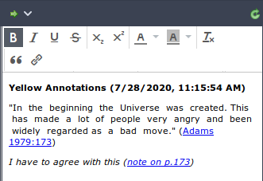
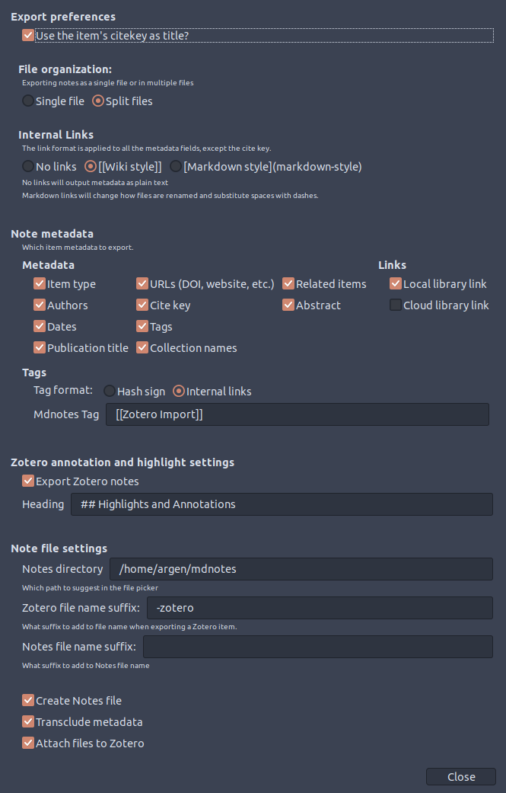

# Mdnotes

A Zotero plugin to export item metadata and notes as markdown files.

## Features

Right now the menu is not context-aware, so read below to see what has to be selected for the menu to correctly create the files.

| Option                                                       | What to select |
| ------------------------------------------------------------ | -------------- |
| [Export Zotero item metadata file](#Export-items-metadata-to-a-markdown-file) | Zotero Item    |
| [Export Zotero notes to markdown](#Export-zotero-notes-to-markdown) | Zotero Note    |
| [Create a file for your own notes](#Create-a-file-for-your-own-notes) | Zotero Item    |
| [Batch export all of the above](#Batch-export-all-of-the-above) | Zotero Item    |

* Based on your configuration, any of the above actions [adds the created files as linked files to Zotero](#Adds-the-created-files-as-linked-files-to-Zotero)

**Note:** After installing, go to `Tools > Mdnotes preferences` and change the Notes directory to a valid path.
See [Configuration](#Configuration).

To access the menu right-click on an item or note to see the options below:  


### Export items' metadata to a markdown file

  **Only works with Zotero items.**

  The `Export Zotero item metadata file` creates a file using the naming convention and (a configurable) suffix, e.g. `citekey - suffix.md`. The file contains the item's title as H1, and the item's metadata and Zotfile-extracted annotations under H2 headers.

  

### Export Zotero notes to markdown

**Only works with Zotero notes**.

The `Export Zotero note to markdown` menu only works with Zotero notes (the ones with the little yellow icon), and that one will export the note contents and save them on a file using the naming convention, e.g. `citekey - <note title>.md`

|                                    | Selected note                                                | Exported note                                                |
| ---------------------------------- | ------------------------------------------------------------ | ------------------------------------------------------------ |
| "Manually" written child notes     |  |  |
| Annotations extracted with Zotfile |  |  |

### Create a file for your own notes

**Only works with Zotero items.**

The `Create Notes file` menu creates a file for your own notes, i.e. it only uses the naming convention (e.g. `citekey.md`) to save a file that includes the item's title as an H1 header, a few links, and a H2 Notes header so you can write below.

#### Format 

```
# <Item's full title>

* Zotero links: <links>

<Metadata link>

## Notes

<Your notes go here>
```

#### Example


### Batch export/create of all of the above

  **Only works with Zotero items.**

### Add the created files as linked files to Zotero

  

## Install

Install by downloading the [latest version](https://github.com/argenos/zotero-mdnotes/releases/latest).


## Requirements

It is highly recommended that you have the following plugins installed:

* [Zotfile](http://zotfile.com/)
* [BetterBibtex](https://retorque.re/zotero-better-bibtex/)

I have not tested without them, so I can't guarantee nothing will break.

## Configuration

Go to `Tools > Mdnotes preferences`



## Notes and Known Limitations

* I assume the exported metadata and Zotero note files are _replaceable_.

  * **Why?** Items in your Zotero library may need to be updated or new annotations/highlights can be made to the PDF.

  * Batch export will overwrite the metadata and Zotero note files **without asking**.

  * The only file not overwritten during batch export is the Notes file which I assume **you** modify and don't want them overwritten! You can use the `Create Notes file` menu to do so.

* The format used to export Zotero notes is somewhat hardcoded and relies on Zotfile's default format. [Let me know](https://github.com/argenos/zotero-mdnotes/issues/new) if this doesn't work for you.

* If you move or rename your markdown files, the links in Zotero will be outdated. The only solution is to manually locate them.

* So far I've been creating one or two notes at a time, as I've been needing them, i.e. I have not tested exporting large numbers of items or notes.

* I can only work on this on my spare time, so it might take me a while to fix your issue. That being said, I'll try to point you in the right direction if you [open an issue](https://github.com/argenos/zotero-mdnotes/issues/new). [Pull requests](https://github.com/argenos/zotero-mdnotes/pulls) are most definitely welcome if you can spare some time.

TL;DR: It works on my machine  
[](https://github.com/nikku/works-on-my-machine)

## Acknowledgements

This plugin is based and was inspired by [zotero-roam-export](https://github.com/melat0nin/zotero-roam-export/).
