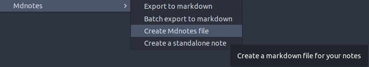

Multi-file exports match 1:1 the [default templates](defaults.md).
You can read more about [item](../placeholders.md#item-placeholders) and [note](../placeholders.md#note-placeholders) placeholders in the next section.

### Mdnotes Default Template

- **Which menu?**: `Create mdnotes file`
- **What to select?**: A Zotero item.

