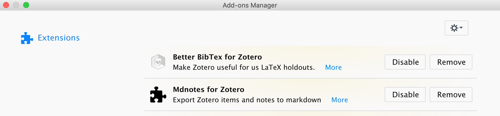
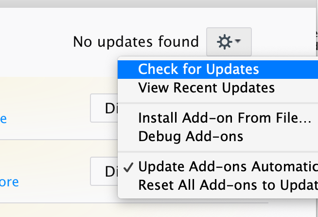

## Update

You can update `.xpi` package automatically through the zotero app or manually update it.
On the top menu bar click on `Tools` >> `AddOns` and you the following page.

### Manually check for updates

To manually check for updates, on the top-right corner click on the gear and select `Check for Updates`:

