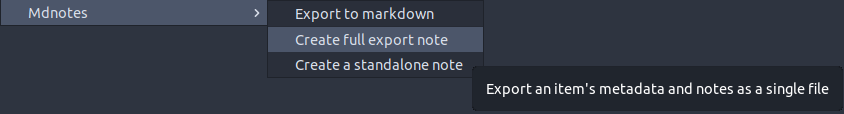

# Single-file Exports

:::caution
Single-file exports will replace your existing file **without** asking for confirmation. If you don't want this to happen, you must use [multi-file exports](multi-file.md).
:::

The `Create full export note` menu exports an item's metadata and its Zotero notes as a single file.
For that it uses the `Mdnotes Default Template`, which you should [edit](../../advanced/templates/single-file.md) by adding your desired metadata placeholders.
Zotero notes included in this export will use the `Zotero Note Template`.

The menus for `Export to markdown` and `Create standalone note` behave in the same way as in multi-file exports, and use their respective templates.

:::info
The file created with the `Create full export note` menu uses the `Mdnotes Default Template` and the prefix and suffix for `Mdnotes` file.
:::
